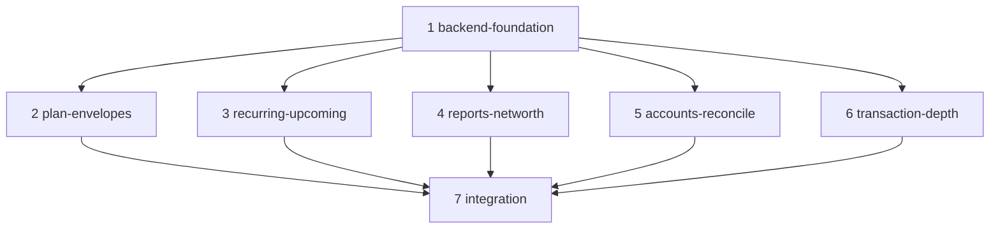

# ledger v3 — scope

## Vision

v3 turns ledger from a 50/30/20 tracker into a full budgeting engine that rivals YNAB's loved core — envelope truth, an assignment moment, targets, upcoming-bill awareness, reconciliation-grade accuracy, and progress reports — while deleting YNAB's tax: no subscription, no cloud, no aggregator, and above all **no 5-minutes-a-day manual tithe**, because the event source stays the bank emails ledger already ingests deterministically. Envelopes layer *under* the existing 50/30/20 jars as progressive disclosure (the jars remain the day-one surface; per-category envelopes with rollover are opt-in depth), recurring bills are *detected* from ingest history rather than typed in, and reconciliation collapses to a 30-second balance check-in whose discrepancies point at retained raw emails instead of a blind adjustment. Everything stays within the core principles: deterministic-first, integer fils, single Go binary + SQLite, Tailscale-private, and the existing dither design language unchanged.

**Explicitly out of scope** (single-user / self-hosted makes them free to drop): multi-user sharing, pricing/subscription anything, bank-API aggregation, loan payoff simulator, Watch/native apps, YNAB's credit-card float machinery (replaced by the simpler balance check-in + net-worth model; card accounts are just accounts with balances).

## Piece map

Piece 1 lands **all** new Go/SQLite work. Pieces 2–6 are frontend-only, own disjoint file sets, and can run in parallel; each keeps its API hooks in a piece-local `api.ts` so none touch the shared client. Piece 7 consolidates shared wiring (nav, router/tab switching, shared api client/types, SSE events, Home glanceables, Settings hub links) and rebuilds the embedded dist.

---

## 1. backend-foundation (backend)

All new schema, store methods, engine math, API routes, detection logic, and push/SSE triggers for every later piece. Additive-only migrations (`CREATE TABLE IF NOT EXISTS` + `addColumn`), backward compatible: the 50/30/20 jar summary keeps working unchanged when no envelopes/targets exist.

**Schema**

- `category_targets` — `category_id` (unique FK), `target_type` (`set_aside`|`refill`|`save_by_date`), `amount_fils`, `cadence` (`weekly`|`monthly`|`yearly`), `due_date` (nullable, for save_by_date).
- `envelope_assignments` — `month` (`YYYY-MM`), `category_id`, `assigned_fils`, unique(month, category_id).
- `scheduled_transactions` — `normalized_merchant`, `label`, `amount_fils`, `tolerance_pct`, `interval_days` (7/14/30/365-style with slack), `next_due`, `direction`, `category_id`, `account_id`, `source` (`manual`|`detected`), `status` (`proposed`|`active`|`paused`|`dismissed`), `last_matched_tx_id`, `last_matched_at`.
- `transaction_splits` — `transaction_id` FK, `category_id`, `amount_fils`, `note`; store method enforces Σ splits = parent amount (integer fils, remainder to last line); parent `category_id` null while split.
- `account_balances` — `account_id` FK, `as_of`, `balance_fils`, `source` (`checkin`|`adjustment`), `note`.
- `accounts.kind` addColumn (`budget`|`tracking`) — tracking accounts (investments, property) count in net worth, never in envelopes.
- `transactions.note` addColumn (user memo, distinct from parsed `description`).
- `rules.display_name` addColumn — merchant clean-name piggybacks the existing rules engine; transaction listing resolves display names.
- `app_settings` addColumns: `notify_thresholds` (on/off), `notify_upcoming_days` (int, 0 = off).

**Engine (`internal/budget/envelope.go`, new `internal/recur/`)**

- Envelope math: per category per month — `carryover + assigned − activity = available` (activity from confirmed txns incl. split lines; multi-currency via existing `amount_aed`). Ready to Assign = month income (config or income categories, same switch as today) − Σ assigned. Needed-this-month per target type (set-aside flat; refill = amount − available; save-by-date = remaining / months left). Overspend flag when available < 0.
- Auto-assign: one call distributes RTA per targets first, then pro-rata by 50/30/20 bucket weights — the day-one no-bootcamp default.
- Recurring detector (deterministic, no AI): group confirmed txns by normalized merchant; ≥3 occurrences at a stable interval (±20%) and stable amount (± tolerance) → propose `scheduled_transactions` row (`status=proposed`). Matcher runs in the ingest post-process hook: new txn matching an active schedule marks it paid, advances `next_due`; `next_due` + grace passed with no match → `missed`; matched amount outside tolerance → `price_change` flag.
- Reports queries in store: net-worth series (latest balance per account per month + tracking), income-v-expense monthly matrix per category (up to 24 months), age of money (FIFO days between income fils and spend fils).

**API** (one file per resource, existing conventions)

- `GET/PUT /api/targets/{categoryId}`, `GET /api/targets`
- `GET /api/envelopes?month=`, `POST /api/envelopes/assign` (batch set), `POST /api/envelopes/move` {from,to,amount_fils}, `POST /api/envelopes/auto-assign`
- `GET /api/scheduled` (incl. proposed), `POST /api/scheduled`, `PUT/DELETE /api/scheduled/{id}`, `POST /api/scheduled/{id}/confirm|dismiss|pause`, `GET /api/upcoming?days=`
- `PUT /api/transactions/{id}/splits` (replace-set), `PUT /api/transactions/{id}/note`; txn list/detail payloads gain `splits`, `note`, `display_name`
- `GET/POST /api/accounts/{id}/balances`, `POST /api/accounts/{id}/checkin` → returns expected balance (last check-in + signed txns since), delta, and count of unparsed/silent ingest rows in the window; `POST /api/accounts/{id}/adjust` writes a balance-adjustment txn; `PUT /api/accounts/{id}` gains `kind`
- `GET /api/reports/networth?months=`, `GET /api/reports/income-expense?months=`, `GET /api/reports/age-of-money`
- Push/SSE: new events `budget_threshold` (envelope or bucket crossing 80%/100%), `upcoming_bill`, `missed_bill`, `schedule_detected`; wired in `cmd/ledger/main.go` next to the existing new_transaction/drift_alert triggers, gated by the new settings.

**YNAB parity:** the entire server side of envelopes/RTA/targets/move-money, scheduled transactions, splits, reconciliation, tracking accounts, and the reports suite.
**Exceeds:** recurring bills are detected from ingest history instead of hand-entered; threshold pushes ride the always-fresh email stream; reconcile inputs can cite retained raw emails; all in one binary + SQLite with integer fils.

**Files:** `internal/store/schema.sql`, `internal/store/store.go`, new `internal/store/{targets,envelopes,scheduled,balances,splits}.go` (+tests), `internal/store/transactions.go`, `internal/budget/envelope.go` (+tests), new `internal/recur/`, `internal/server/server.go` (routes), new `internal/server/{targets,envelopes,scheduled,balances,reports,splits}.go` (+tests), `internal/server/transactions.go`, `cmd/ledger/main.go`.

---

## 2. plan-envelopes (screen)

New **Plan** screen: the envelope decision surface. Ready-to-Assign banner at top (RollingNumber; red when over-assigned), then envelopes grouped by the existing need/want/saving buckets — each row shows available (ProgressBar with the same pace-marker/dither treatment as Home), target progress and needed-this-month, upcoming-bill claim hint, and overspend flag. One-tap **Auto-Assign**; tap a row → assign/edit sheet; **Move Money** flow = two taps (source category → amount) via a Dialog sheet, matching YNAB's roll-with-the-punches speed. Target editor sheet per category (three types + cadence). Envelope depth is optional: categories without targets/assignments simply ride the jar math, so the screen degrades gracefully to today's behavior.

Reuses: `ProgressBar`, `DitherFill`, `RollingNumber`, `Money`, `SegmentedControl`/chips, Dialog-sheet pattern, `.press` feedback, EmptyState. Pure math (rollover display, needed-this-month formatting, over-assignment states) goes in `lib/envelope.ts` per the lib convention.

**YNAB parity:** Plan screen, Ready to Assign, Auto-Assign, three target types, rollover envelopes, move money, overspend flags.
**Exceeds:** envelope activity is fed by zero-entry ingest so "available" is always current with no approve step; auto-assign is seeded from the 50/30/20 plan so there is a working budget on day one with no methodology bootcamp; envelopes stay optional per category.

**Files:** new `frontend/src/screens/plan/` (PlanScreen.tsx, EnvelopeRow.tsx, ReadyToAssignBanner.tsx, AssignSheet.tsx, MoveMoneySheet.tsx, TargetSheet.tsx, api.ts, tests + stories), new `frontend/src/lib/envelope.ts` (+test). Touches nothing shared.

---

## 3. recurring-upcoming (flow)

Recurring & upcoming money flow. Three surfaces in one screen dir: (a) **Detected** — proposed schedules from the detector presented as confirm/dismiss cards (same triage spirit as the Review deck: provenance line "seen 6× every ~30 days at 39.00 AED", tap to see matched transactions); (b) **Upcoming** — the next N days of expected bills with amounts and due dates, plus `missed` (bill's email never arrived — the app noticing an *absence*) and `price_change` badges; (c) manual schedule create/edit form for the few bills that don't email. Paid items show the matched transaction link.

Reuses: list-row + chip components, card patterns from ProjectCards, Dialog sheets, EmptyState, Toast for confirm/dismiss undo. Recurrence label math ("every 30 days", next-due countdown, missed grace) in `lib/recurring.ts`.

**YNAB parity:** scheduled & repeating transactions, upcoming hints, "Enter Now" equivalent (the email enters it for you).
**Exceeds:** YNAB users type their repeat rules; ledger mines them deterministically from ingest history, auto-matches arrivals, and — uniquely — flags when an expected bill *didn't* arrive and when a subscription price crept up.

**Files:** new `frontend/src/screens/recurring/` (RecurringScreen.tsx, DetectedCards.tsx, UpcomingFeed.tsx, ScheduleForm.tsx, api.ts, tests + stories), new `frontend/src/lib/recurring.ts` (+test).

---

## 4. reports-networth (screen)

Reports suite: **Net Worth** line (budget + tracking accounts from balance check-ins, dither-styled area/line in the existing chart language), **Income v Expense** monthly matrix (category rows × months with averages/totals, TanStack Table inside an `overflow-x` container), **Age of Money** tile with sparkline and a one-line explainer, and trend depth: existing trend endpoint driven to its full 24 months with year-over-year compare. Entry point: links/tiles from the existing Insights screen (this piece owns `Insights.tsx` edits); every report drills down to underlying transactions via the existing DrillDownSheet pattern rebuilt locally to avoid shared-file edits.

Reuses: `DitherFill`, dither-kit bar-chart + core, TrendBars idiom, `Money`, chart-scrub interaction (`lib/chartScrub.ts` read-only), SegmentedControl for period switching. New chart components live inside the piece dir, not `components/charts/`.

**YNAB parity:** Net Worth, Income v Expense, Spending trends, Age of Money — the 2025-remodel reports dashboard.
**Exceeds:** reports run over a 100%-captured local dataset (nothing an aggregator dropped), every number drills to source transactions and their retained raw emails, and it's computed locally — no cloud, no export ceremony.

**Files:** new `frontend/src/screens/reports/` (ReportsScreen.tsx, NetWorthChart.tsx, IncomeExpenseMatrix.tsx, AgeOfMoneyTile.tsx, TrendCompare.tsx, api.ts, tests + stories), `frontend/src/screens/Insights.tsx` (+ its test) for entry tiles, new `frontend/src/lib/reports.ts` (+test).

---

## 5. accounts-reconcile (flow)

Balance ground truth. Accounts screen with per-account current balance (last check-in ± signed transactions since) and a **Check-in** sheet: type the balance from the bank app (16px input, fils-safe), ledger shows expected vs stated; on mismatch, a discrepancy card lists candidate causes — unparsed/silent emails in the window (linked to their raw source), cash/ATM spend — with one tap to write an adjustment transaction or to open manual entry. Tracking accounts (kind=`tracking`) get simple balance updates and feed net worth only. Per-account balance history sparkline. Absorbs/upgrades the current settings AccountsPage (this piece owns that file; the hub link is rewired in integration).

Reuses: list rows, Dialog sheets, `Money`, RollingNumber for the computed balance, Toast, EmptyState, sparkline via DitherFill idiom.

**YNAB parity:** reconciliation with auto balance-adjustment, cleared-balance trust, budget vs tracking accounts, multi-account.
**Exceeds:** reconcile is a 30-second balance paste, not a line-item ceremony — and because every email is retained in `ingest_log`, a mismatch points at the exact candidate emails that failed to parse ("nothing silently dropped") instead of a blind adjustment.

**Files:** new `frontend/src/screens/accounts/` (AccountsScreen.tsx, AccountDetail.tsx, CheckinSheet.tsx, DiscrepancyCard.tsx, api.ts, tests + stories), `frontend/src/screens/settings/AccountsPage.tsx` (+ its test) to redirect/absorb, new `frontend/src/lib/reconcile.ts` (+test).

---

## 6. transaction-depth (flow)

Transaction truth upgrades inside the existing register surfaces: **split transactions** (SplitSheet: divide a transaction across categories with live remainder, integer-fils exact, last line absorbs rounding; split rows render as an expandable stack in the list and detail), **user notes** (memo field in the detail sheet, distinct from parsed description), and **merchant clean names** (rename once from the detail sheet → writes `display_name` onto the matching rule via the existing rule write-back, cleaning history and all future mail). Splits respect provenance: the parent keeps its fingerprint, raw email link, and refund/project machinery.

Reuses: `TransactionDetailSheet` (owned + extended here), CategorizeSheet's bucket-grouped chip picker pattern rebuilt inside SplitSheet, `Money`, Dialog sheets, Toast undo.

**YNAB parity:** split transactions, memos, payee renaming/management.
**Exceeds:** splitting an auto-ingested transaction never breaks its provenance chain (source email one tap away), and a single rename piggybacks the self-improving rules engine — every past and future occurrence of the merchant is cleaned, no per-transaction payee editing treadmill.

**Files:** `frontend/src/components/transactions/` (TransactionDetailSheet.tsx + new SplitSheet.tsx, NoteField.tsx, RenameMerchantSheet.tsx, tests + stories), `frontend/src/screens/Transactions.tsx` (+ its test) for split-row rendering, new `frontend/src/lib/txSplit.ts` (+test). Does not touch the Review deck or shared api client.

---

## 7. integration (system)

Shared wiring, landed once after pieces 2–6: tab/nav rework in `app/nav.ts` + `AppShell.tsx` (add **Plan** as a primary tab; Reports and Accounts and Recurring reachable from Insights/Settings/Home — final arrangement decided here, keeping five visible tabs and the current calm nav); consolidate the piece-local `api.ts` hooks into the shared `api/client.ts` + `api/types.ts`; extend `lib/liveInvalidation.ts` for the new SSE events (`budget_threshold`, `upcoming_bill`, `missed_bill`, `schedule_detected`); Home glanceables (RTA chip, next-upcoming-bill hint, net-worth delta tile — widget-equivalent pocket surface); new Settings **Notifications** page (threshold + upcoming-days toggles) and hub links to Recurring/Accounts; update `components/README.md` catalog for new shared components; run the full story regression net; rebuild frontend + `internal/web/dist` so the embedded bundle matches (parallel-sessions rule).

**YNAB parity:** the "one plan everywhere" coherence — widgets-on-home glanceability, cross-screen consistency, notification preferences.
**Exceeds:** every glanceable is SSE-live — an arriving bank email updates envelope availability, upcoming bills, and Home within seconds, with push for threshold crossings; all served from the same embedded single binary.

**Files:** `frontend/src/app/nav.ts`, `frontend/src/app/AppShell.tsx` (+tests), `frontend/src/api/client.ts`, `frontend/src/api/types.ts`, `frontend/src/screens/Home.tsx` (+test), `frontend/src/screens/settings/SettingsHub.tsx`, new `frontend/src/screens/settings/NotificationsPage.tsx`, `frontend/src/lib/liveInvalidation.ts` (+test), `frontend/src/components/README.md`, rebuilt `internal/web/dist/`.
